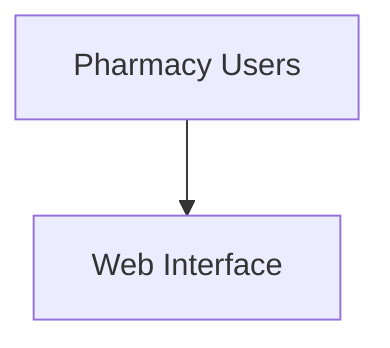

````markdown
<!-- ===================================================== -->
<!--                 ANIMATED PROFILE HEADER                -->
<!-- ===================================================== -->

<p align="center">
  
</p>

<p align="center">
  <a href="https://github.com/YUET-944">
    
  </a>
</p>

<p align="center">
  <a href="https://algohubsmc.com">
    
  </a>
  <a href="https://www.linkedin.com/in/muhammad-younas-khan-72b102264/">
    
  </a>
  <a href="mailto:contact@algohubsmc.com">
    
  </a>
</p>

<p align="center">
  
  
  
</p>

---

<!-- ===================================================== -->
<!--                       ABOUT ME                         -->
<!-- ===================================================== -->

## 👨‍💻 About Me


I am **Muhammad Younas Khan**, also known as **Ahbab**—a BS Data Science student at [UET Mardan](https://uetmardan.edu.pk/) and the Founder and CEO of [AlgoHub SMC (Pvt) Ltd](https://algohubsmc.com).

I work at the intersection of **software engineering, artificial intelligence, data science, SaaS development, and business automation**. My goal is to transform practical problems into secure, scalable, and user-friendly digital products.

- 🎓 BS Data Science student at **UET Mardan**
- 👑 Founder and CEO of **AlgoHub SMC (Pvt) Ltd**
- 💻 Developer of AI-powered, SaaS, web, and database systems
- 🤖 Interested in applied AI, machine learning, OCR, and RAG
- ☁️ Exploring cloud services and digital transformation
- ⚡ Working with Microsoft Power Platform and Dynamics 365
- 🌍 Open to international projects and technical collaboration
- 🤝 Passionate about student communities and open-source development

<br clear="right"/>

---

## 🚀 What I Am Building

```text
AI & Data Science       ███████████████████░  95%
SaaS Development        ██████████████████░░  90%
Backend Engineering     ██████████████████░░  90%
Database Design         █████████████████░░░  85%
Business Automation     ████████████████░░░░  80%
Cloud Technologies      █████████████░░░░░░░  65%
Open Source             ████████████░░░░░░░░  60%
````

### Current priorities

* 💊 Building a multi-tenant **Pharmacy Management SaaS**
* 📚 Developing an **AI-Powered Digital Textbook Library**
* 🌫️ Improving the **SmogNet Environmental Intelligence Platform**
* 🔐 Designing secure authentication, RBAC, and tenant-isolation systems
* ⚙️ Automating business processes using Power Platform
* 🌱 Growing an inclusive student and open-source community

---

<!-- ===================================================== -->

<!--                  FEATURED PROJECTS                     -->

<!-- ===================================================== -->

## 🌟 Featured Projects

### 📚 AI-Powered Digital Textbook Library

<p>
  <a href="https://github.com/YUET-944?tab=repositories&q=digital+library">
    
  </a>
  
</p>

An intelligent educational platform designed for Grade 9–12 textbooks. It uses OCR, semantic search, vector embeddings, and retrieval-augmented generation to provide accurate answers supported by textbook references.

**Core technologies:** ASP.NET Core MVC, C#, Python, OCR, RAG, Vector Search and SQL Server.

<details>
<summary><strong>View project details</strong></summary>

#### Problem

Students often search through complete scanned textbooks manually to locate a particular concept, definition, or answer.

#### Solution

The system extracts text from scanned textbooks, divides it into searchable chunks, generates embeddings, retrieves relevant content, and provides source-grounded answers.

#### Main features

* Scanned-PDF textbook processing
* OCR-based text extraction
* Semantic textbook search
* Retrieval-augmented question answering
* Grade, subject, board, and language management
* Student and administrator dashboards
* Source and page-level references

#### Project status

Active final-year project development.

</details>

---

### 💊 Pharmacy Management SaaS

<p>
  <a href="https://github.com/YUET-944/Pharmacy-Managment-System">
    
  </a>
  
</p>

A multi-tenant pharmacy platform for managing branches, medicines, batches, POS operations, subscriptions, billing, employees, permissions, reports, and business workflows.

**Core technologies:** PHP, MySQL, Bootstrap, JavaScript, HTML and CSS.

<details>
<summary><strong>View project details</strong></summary>

#### Problem

Independent and multi-branch pharmacies frequently depend on disconnected systems or manual processes for inventory, sales, staff access, and billing.

#### Solution

The platform brings pharmacy operations into one secure multi-tenant SaaS environment.

#### Main features

* Multi-tenant pharmacy workspaces
* Point-of-sale operations
* Medicine and batch management
* FEFO inventory handling
* Supplier and customer management
* Multi-branch operations
* Role-based access control
* Subscription and billing management
* Sales, inventory, and financial reports
* Platform administration portal

#### Architecture


