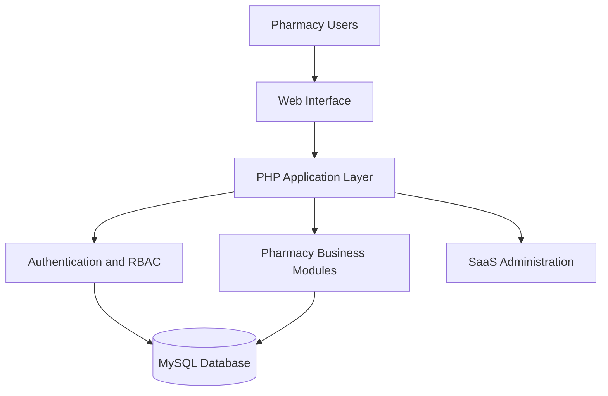

<!-- ===================================================== -->
<!--                 ANIMATED PROFILE HEADER                -->
<!-- ===================================================== -->

<p align="center">
  
</p>

<p align="center">
  <a href="https://github.com/YUET-944">
    
  </a>
</p>

<p align="center">
  <a href="https://algohubsmc.com">
    
  </a>
  <a href="https://www.linkedin.com/in/muhammad-younas-khan-72b102264/">
    
  </a>
  <a href="mailto:contact@algohubsmc.com">
    
  </a>
</p>

<p align="center">
  
  
  
</p>

---

<!-- ===================================================== -->
<!--                       ABOUT ME                         -->
<!-- ===================================================== -->

## 👨‍💻 About Me


I am **Muhammad Younas Khan**, also known as **Ahbab**—a BS Data Science student at [UET Mardan](https://uetmardan.edu.pk/) and the Founder and CEO of [AlgoHub SMC (Pvt) Ltd](https://algohubsmc.com).

I work at the intersection of **software engineering, artificial intelligence, data science, SaaS development, and business automation**. My goal is to transform practical problems into secure, scalable, and user-friendly digital products.

- 🎓 BS Data Science student at **UET Mardan**
- 👑 Founder and CEO of **AlgoHub SMC (Pvt) Ltd**
- 💻 Developer of AI-powered, SaaS, web, and database systems
- 🤖 Interested in applied AI, machine learning, OCR, and RAG
- ☁️ Exploring cloud services and digital transformation
- ⚡ Working with Microsoft Power Platform and Dynamics 365
- 🌍 Open to international projects and technical collaboration
- 🤝 Passionate about student communities and open-source development

<br clear="right"/>

---

## 🚀 What I Am Building

```text
AI & Data Science       ███████████████████░  95%
SaaS Development        ██████████████████░░  90%
Backend Engineering     ██████████████████░░  90%
Database Design         █████████████████░░░  85%
Business Automation     ████████████████░░░░  80%
Cloud Technologies      █████████████░░░░░░░  65%
Open Source             ████████████░░░░░░░░  60%
````

### Current priorities

* 💊 Building a multi-tenant **Pharmacy Management SaaS**
* 📚 Developing an **AI-Powered Digital Textbook Library**
* 🌫️ Improving the **SmogNet Environmental Intelligence Platform**
* 🔐 Designing secure authentication, RBAC, and tenant-isolation systems
* ⚙️ Automating business processes using Power Platform
* 🌱 Growing an inclusive student and open-source community

---

<!-- ===================================================== -->

<!--                  FEATURED PROJECTS                     -->

<!-- ===================================================== -->

## 🌟 Featured Projects

### 📚 AI-Powered Digital Textbook Library

<p>
  <a href="https://github.com/YUET-944?tab=repositories&q=digital+library">
    
  </a>
  
</p>

An intelligent educational platform designed for Grade 9–12 textbooks. It uses OCR, semantic search, vector embeddings, and retrieval-augmented generation to provide accurate answers supported by textbook references.

**Core technologies:** ASP.NET Core MVC, C#, Python, OCR, RAG, Vector Search and SQL Server.

<details>
<summary><strong>View project details</strong></summary>

#### Problem

Students often search through complete scanned textbooks manually to locate a particular concept, definition, or answer.

#### Solution

The system extracts text from scanned textbooks, divides it into searchable chunks, generates embeddings, retrieves relevant content, and provides source-grounded answers.

#### Main features

* Scanned-PDF textbook processing
* OCR-based text extraction
* Semantic textbook search
* Retrieval-augmented question answering
* Grade, subject, board, and language management
* Student and administrator dashboards
* Source and page-level references

#### Project status

Active final-year project development.

</details>

---

### 💊 Pharmacy Management SaaS

<p>
  <a href="https://github.com/YUET-944/Pharmacy-Managment-System">
    
  </a>
  
</p>

A multi-tenant pharmacy platform for managing branches, medicines, batches, POS operations, subscriptions, billing, employees, permissions, reports, and business workflows.

**Core technologies:** PHP, MySQL, Bootstrap, JavaScript, HTML and CSS.

<details>
<summary><strong>View project details</strong></summary>

#### Problem

Independent and multi-branch pharmacies frequently depend on disconnected systems or manual processes for inventory, sales, staff access, and billing.

#### Solution

The platform brings pharmacy operations into one secure multi-tenant SaaS environment.

#### Main features

* Multi-tenant pharmacy workspaces
* Point-of-sale operations
* Medicine and batch management
* FEFO inventory handling
* Supplier and customer management
* Multi-branch operations
* Role-based access control
* Subscription and billing management
* Sales, inventory, and financial reports
* Platform administration portal

#### Architecture



</details>

---

### 🌫️ SmogNet Environmental Intelligence

<p>
  <a href="https://github.com/YUET-944?tab=repositories&q=SmogNet">
    
  </a>
  
</p>

An environmental intelligence initiative focused on air-quality data, smog analysis, machine learning, source classification, and evidence-based decision support.

**Core technologies:** Python, Pandas, NumPy, Scikit-learn, data visualization and environmental datasets.

<details>
<summary><strong>View project details</strong></summary>

#### Research objective

To explore how environmental data and machine-learning techniques can help identify pollution patterns, classify likely sources, and support air-quality decision-making.

#### Main areas

* Air-quality data preprocessing
* Pollution trend analysis
* Source classification
* Environmental visualization
* Predictive modelling
* Research-backed interpretation
* Sustainable-development alignment

</details>

---

### 🏙️ Urban IQ

<p>
  <a href="https://github.com/AlgoHub-2025/Urban_IQ">
    
  </a>
  
</p>

A smart-city and civic-technology initiative designed to support data-driven urban planning, public-service improvement, and intelligent decision-making.

**Core areas:** Data Science, Analytics, Smart Cities and Web Technologies.

---

### ⚡ Electricity Management CRM

<p>
  
  
</p>

A Dynamics 365 solution for electricity-consumer records, meters, meter readings, billing, payments, complaint handling, employee assignments, and workflow automation.

**Core technologies:** Dynamics 365, Dataverse, Power Apps, Power Automate, JavaScript, C# Plugins and PCF.

<details>
<summary><strong>View project details</strong></summary>

#### Main features

* Consumer and meter management
* Electricity billing records
* Meter-reading workflows
* Payment tracking
* Complaint lifecycle management
* Employee assignment
* Automated notifications
* Role-based security
* Power Pages customer portal
* Custom PCF priority visualization
* Operational dashboards and charts

</details>

---

### 🏥 Clinic Management System

<p>
  <a href="https://github.com/YUET-944?tab=repositories&q=clinic">
    
  </a>
</p>

A healthcare-management application for appointments, doctors, staff permissions, digital prescriptions, patient history, payments, and financial reporting.

**Core technologies:** PHP, Vue.js, MySQL and responsive UI design.

---

> Some direct repository and live-demonstration links will be added after the repositories complete their documentation and deployment audits.

---

<!-- ===================================================== -->

<!--                    TECHNOLOGIES                        -->

<!-- ===================================================== -->

## 🧰 Technology Arsenal

### Languages

<p align="center">
  
</p>

### Frameworks and Platforms

<p align="center">
  
</p>

### Databases

<p align="center">
  
</p>

### Development Tools

<p align="center">
  
</p>

### Specialized Areas

<p align="center">
  
  
  
  
  
  
</p>

---

<!-- ===================================================== -->

<!--                  COMMUNITY LEADERSHIP                  -->

<!-- ===================================================== -->

## 🌍 Community and Leadership

As the Founder of **AlgoHub SMC**, I want to combine technical product development with meaningful community impact.

My community objectives include:

* Helping students make their first open-source contributions
* Organizing practical Git, GitHub, programming, and AI workshops
* Supporting student-led software and research projects
* Connecting students with hackathons and international communities
* Creating beginner-friendly technical resources
* Encouraging technology-based solutions to local problems
* Building an inclusive developer community at UET Mardan

> Strong technical communities grow when knowledge, mentorship, and opportunities are shared openly.

---

## 🏅 Certifications and Professional Development

| Certification or Training | Area                                           |
| ------------------------- | ---------------------------------------------- |
| **Microsoft SC-900**      | Security, Compliance and Identity Fundamentals |
| Frontend Web Development  | Modern responsive web interfaces               |
| React Development         | Component-based frontend development           |
| Advanced Python           | OOP, databases and application development     |
| Microsoft Power Platform  | Power Apps, Power Automate and Dataverse       |
| Dynamics 365 Development  | CRM customization, JavaScript, plugins and PCF |

---

<!-- ===================================================== -->

<!--                    GITHUB ANALYTICS                    -->

<!-- ===================================================== -->

## 📊 GitHub Analytics

<p align="center">
  
  
</p>

<p align="center">
  
</p>

<p align="center">
  
</p>

---

## 🤝 Open to Collaboration

I am interested in collaborating on:

* Artificial intelligence and machine-learning projects
* Open-source educational technology
* SaaS and business-automation platforms
* Environmental and sustainability solutions
* Healthcare and pharmacy technologies
* Data analytics and decision-support systems
* Microsoft Power Platform solutions
* Hackathons, datathons, and research initiatives
* Student-led developer communities

If you are working on a meaningful project, I would be happy to connect and explore how we can collaborate.

---

## 📬 Connect With Me

<p align="center">
  <a href="https://algohubsmc.com">
    
  </a>
  <a href="mailto:contact@algohubsmc.com">
    
  </a>
  <a href="https://www.linkedin.com/in/muhammad-younas-khan-72b102264/">
    
  </a>
  <a href="https://github.com/YUET-944">
    
  </a>
</p>

<p align="center">
  <strong>Available for open-source collaboration, research, software projects, and international opportunities.</strong>
</p>

---

## 💭 Personal Philosophy

<p align="center">
  <em>
    “Build useful technology, document the journey, share the knowledge,
    and help others grow along the way.”
  </em>
</p>

<p align="center">
  <strong>Keep learning · Keep building · Keep contributing</strong>
</p>

<!-- ===================================================== -->

<!--                  ANIMATED PROFILE FOOTER               -->

<!-- ===================================================== -->

<p align="center">
  
</p>
```
